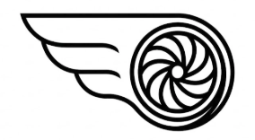

<p align="center">
  
</p>

<h1 align="center">LEAP-Guard 360</h1>

<p align="center">
  <strong>Predictive Maintenance for Aviation Engines</strong><br/>
  Deep Learning Anomaly Detection + Generative AI Diagnostics
</p>

<p align="center">
  
  
  
  
  
</p>

<p align="center">
  <a href="#-live-demo">Live Demo</a> •
  <a href="#-key-features">Features</a> •
  <a href="#%EF%B8%8F-architecture">Architecture</a> •
  <a href="#-getting-started">Getting Started</a> •
  <a href="#-model-performance">Performance</a>
</p>

---

## Overview

**LEAP-Guard 360** is a full-stack predictive maintenance system that combines **LSTM-Autoencoder anomaly detection** with **AWS Bedrock GenAI diagnostics** to identify and explain turbofan engine degradation patterns.

This project demonstrates production-grade ML engineering practices for the aviation MRO (Maintenance, Repair, Overhaul) sector:

| Capability | Implementation |
|------------|----------------|
| **Anomaly Detection** | LSTM-Autoencoder trained on NASA CMAPSS turbofan dataset |
| **Explainable AI** | AWS Bedrock (Claude Haiku 4.5) generates natural language diagnostics |
| **Cloud Architecture** | Serverless Lambda + S3 with cost optimization (<$0.10/month) |
| **Frontend** | React + TypeScript dashboard with real-time sensor visualization |

---

## Key Features

### Predictive Anomaly Detection
- **LSTM-Autoencoder** learns normal engine behavior from healthy sensor patterns
- Reconstruction error quantifies deviation from expected operation
- Identifies degradation **before** threshold-based alerts trigger

### GenAI-Powered Diagnostics
- Converts numerical anomaly scores into actionable maintenance recommendations
- Provides root cause analysis citing specific engine components (HPC, LPT, etc.)
- Context-aware responses tailored to aviation MRO engineers

### Cost-Optimized Architecture
- **Scale-to-Zero**: No compute costs when idle (Lambda + S3 static hosting)
- **FinOps-aware**: Bedrock pay-per-token vs. always-on SageMaker endpoints
- Production-ready containerization via Docker + ECR

---

## Architecture

```
┌────────────────────────────────────────────────────────────────────────────┐
│                              LEAP-Guard 360                                │
├────────────────────────────────────────────────────────────────────────────┤
│                                                                            │
│   ┌──────────────────┐         ┌──────────────────────────────────────┐    │
│   │   React + TS     │  POST   │     AWS Lambda (Docker Container)    │    │
│   │   Dashboard      │────────▶│                                      │    │
│   │                  │◀────────│  ┌────────────┐    ┌─────────────┐   │    │
│   │  • Sensor Graphs │  JSON   │  │   LSTM     │    │   Bedrock   │   │    │
│   │  • Anomaly Viz   │         │  │ Autoencoder│───▶│(Haiku 4.5)  │   │    │
│   │  • Chat UI       │         │  └────────────┘    └─────────────┘   │    │
│   └──────────────────┘         └──────────────────────────────────────┘    │
│          │                                    │                            │
│          ▼                                    ▼                            │
│   ┌──────────────────┐         ┌──────────────────────────────────────┐    │
│   │  S3 Static Host  │         │  Model Artifacts                     │    │
│   │  (CloudFront)    │         │  • leap_guard_model.pth (260KB)      │    │
│   └──────────────────┘         │  • leap_guard_scaler.pkl             │    │
│                                │  • threshold.json / config.json      │    │
│                                └──────────────────────────────────────┘    │
└────────────────────────────────────────────────────────────────────────────┘
```

### Data Flow

1. **Frontend** loads simulated engine sensor data
2. User selects analysis window → triggers inference request
3. **Lambda** preprocesses data with fitted `MinMaxScaler`
4. **LSTM-Autoencoder** computes reconstruction error (anomaly score)
5. If `score > threshold` → **Bedrock** generates natural language diagnosis
6. Results rendered: sensor graph with anomaly highlighting + diagnostic chat

---

## Tech Stack

| Layer | Technology | Rationale |
|-------|------------|-----------|
| **ML Model** | PyTorch LSTM-Autoencoder | Captures temporal degradation patterns in sequence data |
| **Training** | Google Colab (T4 GPU) | Free GPU compute for model development |
| **Backend** | Python 3.12 + Lambda | Serverless inference, zero idle cost |
| **GenAI** | AWS Bedrock (Claude Haiku 4.5) | Low-latency, cost-effective |
| **Container** | Docker → ECR → Lambda | Reproducible ML environment |
| **Frontend** | React + TypeScript + Vite | Type-safe, modern tooling |
| **Visualization** | Recharts | Time-series sensor graphs |
| **Hosting** | S3 + CloudFront | Static hosting with global CDN |
| **IaC** | AWS SAM | Serverless deployment automation |

---

## Model Performance

### Dataset: NASA CMAPSS (FD001)
The model is trained on the **Commercial Modular Aero-Propulsion System Simulation** dataset—the gold standard for turbofan degradation research.

| Property | Value |
|----------|-------|
| Training Engines | 80 run-to-failure trajectories |
| Validation Engines | 20 held-out units |
| Sensors | 8 selected features (temperature, pressure, RPM, vibration) |
| Sequence Length | 10 cycles |
| Anomaly Threshold | 0.122 MAE (95th percentile + 5% buffer) |

### Model Architecture

```
Input (10 timesteps × 8 features)
         ↓
    LSTM Encoder (64 → 32 units)
         ↓
    Latent Bottleneck (32-dim)
         ↓
    LSTM Decoder (32 → 64 units)
         ↓
    Dense Reconstruction (8 features)
```

### Anomaly Detection Logic
- Train on **healthy cycles only** (early engine life)
- High reconstruction error = deviation from learned normal behavior
- Provides **sensor-level attribution** (which sensors contribute most to anomaly)

---

## Project Structure

```
leap-guard/
├── backend/
│   ├── app/
│   │   ├── handler.py          # Lambda entry point
│   │   ├── inference.py        # Model loading & prediction
│   │   ├── bedrock_client.py   # GenAI diagnosis calls
│   │   └── schemas.py          # Pydantic request/response validation
│   ├── model/
│   │   ├── leap_guard_model.pth   # Trained LSTM-Autoencoder weights
│   │   ├── leap_guard_scaler.pkl  # Fitted MinMaxScaler
│   │   ├── threshold.json         # Anomaly threshold (0.122)
│   │   └── config.json            # Feature configuration
│   ├── tests/
│   ├── Dockerfile
│   ├── requirements.txt
│   └── template.yaml           # SAM deployment template
│
├── frontend/
│   ├── src/
│   │   ├── components/         # React components
│   │   ├── hooks/              # Custom hooks (useInference)
│   │   └── types/              # TypeScript interfaces
│   └── vite.config.ts
│
├── notebooks/
│   └── training.ipynb          # Model training notebook (Colab)
│
└── docs/
    ├── PRD.md                  # Product requirements
    ├── implementation-plan.md  # Technical design
    └── AWS_Options.md          # Architecture cost analysis
```

---

## Getting Started

### Prerequisites

- Python 3.12+
- Node.js 18+
- Docker Desktop
- AWS CLI v2 (configured)
- AWS SAM CLI

### Local Development

**Backend (Lambda):**
```bash
cd backend/
pip install -r requirements.txt

# Run tests
pytest tests/

# Local Lambda invocation
sam build
sam local invoke InferenceFunction -e events/test_event.json

# Mock Bedrock for offline development
export MOCK_BEDROCK=true
```

**Frontend:**
```bash
cd frontend/
npm install
npm run dev  # http://localhost:5173
```

### Deployment

**1. Push Docker image to ECR:**
```bash
aws ecr get-login-password --region ap-southeast-1 | docker login --username AWS --password-stdin <account-id>.dkr.ecr.ap-southeast-1.amazonaws.com

docker build -t leap-guard-inference backend/
docker tag leap-guard-inference:latest <account-id>.dkr.ecr.ap-southeast-1.amazonaws.com/leap-guard-inference:latest
docker push <account-id>.dkr.ecr.ap-southeast-1.amazonaws.com/leap-guard-inference:latest
```

**2. Deploy Lambda:**
```bash
cd backend/
sam deploy --guided
```

**3. Deploy Frontend:**
```bash
cd frontend/
npm run build
aws s3 sync dist/ s3://leap-guard-frontend-<account-id> --delete
```

---

## API Reference

### `POST /predict`

**Request:**
```json
{
  "sensor_readings": [[642.15, 1589.70, 1406.36, ...], ...],
  "window_size": 10,
  "threshold": 0.12
}
```

**Response:**
```json
{
  "anomaly_score": 0.185,
  "threshold": 0.122,
  "is_anomaly": true,
  "diagnosis": "Elevated T3 (HPC outlet temperature) readings suggest possible compressor seal degradation. Recommend borescope inspection at next scheduled maintenance.",
  "sensor_contributions": {
    "T3_HPC_Temp": 0.42,
    "P3_HPC_Pressure": 0.28,
    "N2_Core_RPM": 0.18
  }
}
```

---

## Cost Analysis

Architecture designed for **<$0.10/month** demo usage:

| Service | Usage | Cost |
|---------|-------|------|
| Lambda | 500 requests/month | $0.00 (Free Tier) |
| S3 | 100MB static hosting | $0.01 |
| Bedrock | 100 Claude Haiku queries | ~$0.05 |
| ECR | 500MB container storage | $0.05 |
| **Total** | | **~$0.10/month** |

### Production Scaling Path
For high-traffic production: migrate to **SageMaker Endpoints** (consistent latency), add **API Gateway** (throttling/auth), implement **Cognito** (user management), and consider **Kinesis** for real-time streaming.

---

## Design Decisions

| Decision | Rationale |
|----------|-----------|
| **Lambda over SageMaker** | Cost optimization for demo; shows FinOps awareness |
| **Bedrock over OpenAI** | AWS-native integration, pay-per-token, enterprise compliance |
| **LSTM over Transformer** | Proven for time-series, lower compute requirements |
| **PyTorch over TensorFlow** | Better Lambda support, more flexible architecture |
| **TypeScript frontend** | Type safety critical for aviation-context reliability |

---

## Future Roadmap

- [ ] Real-time streaming with Kinesis Data Streams
- [ ] Multi-engine fleet dashboard
- [ ] Historical trend analysis and RUL prediction
- [ ] Integration with maintenance scheduling systems
- [ ] Mobile-responsive design

---

## Skills Demonstrated

This project showcases competencies relevant to **ML Engineering in Aviation MRO**:

| Skill Area | Evidence |
|------------|----------|
| **Predictive Modeling** | LSTM-Autoencoder for failure forecasting |
| **Generative AI** | AWS Bedrock integration with prompt engineering |
| **AWS Services** | Lambda, S3, ECR, Bedrock, CloudWatch, IAM |
| **Python** | PyTorch, NumPy, Pydantic, pytest |
| **Containerization** | Docker multi-stage builds, ECR deployment |
| **Frontend** | React, TypeScript, Vite, Recharts |
| **MLOps** | Model versioning, artifact management, SAM IaC |
| **FinOps** | Cost-optimized serverless architecture |

---

## Author

**Raymond Luo**

Building ML systems for aviation predictive maintenance.

---

## License

This project is for demonstration purposes. NASA CMAPSS dataset is publicly available for research use.
